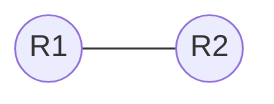

## 問題1 Northbound API の機能は何ですか。

### 選択肢
- A. ソフトウェアをアップグレードし、ファイルを復元します
- B. グローバルなプロビジョニングと構成に依存します
- C. 構成の分散処理をサポートします
- D. SDN コントローラーとネットワーク アプリケーション間のパスを提供します

### 解答・解説

  
正解と解説を確認する

**正解: D**

#### 解説
SDN（Software Defined Networking）アーキテクチャにおいて、APIは方向によって役割が異なります。
- **Northbound API**: SDNコントローラと上位のアプリケーション（管理ソフトなど）の間の通信に使用されます。
- **Southbound API**: SDNコントローラと下位のネットワークデバイス（スイッチやルータ）の間の通信（OpenFlowなど）に使用されます。

:::tip
SDNコントローラを中心に、上（北）がアプリ、下（南）がデバイスと覚えると分かりやすいです。
:::

---

## 問題2 [ワイヤレス] ドラッグアンドドロップ (スプリットMACアーキテクチャ)

### 問題文
スプリットMACアーキテクチャにおける役割を、管理型（Lightweight AP）と自律型に分類してください。

### 解答・解説

  
正解と解説を確認する

**正解: (以下の通り)**

- **スプリットMAC (管理型 AP + WLC)**
  - 作業はアクセスポイントとコントローラの間で分割されます
  - ビーコンフレームを送信します（※注：APが送信）
  - CAPWAP トンネリングプロトコルを使用します
- **自律型 (Autonomous AP)**
  - 中小企業環境に最適
  - デバイスごとの構成と管理をサポート

#### 解説
スプリットMACアーキテクチャでは、リアルタイムな処理（ビーコン送信、応答確認など）をAPが行い、管理処理（認証、ポリシー適用など）をWLCが行います。

---

## 問題3 [Ansible] ドラッグアンドドロップ

### 問題文
Ansibleの用語と説明を正しく組み合わせてください。

### 解答・解説

  
正解と解説を確認する

**正解: (以下の通り)**

- **playbook**: YAMLで記述された自動化タスクの集合
- **コントロールノード**: 対象デバイスを管理するAnsibleがインストールされたデバイス
- **マネージドノード**: コマンドを実行できるAnsibleがインストールされていないネットワークデバイス
- **モジュール**: 1つ以上のターゲットデバイスに対して実行される特定の操作
- **タスク**: 実行されるPythonコードの単位
- **インベントリ**: コマンドとタスクを実行できるターゲットデバイスを定義するファイル

#### 解説
Ansibleはエージェントレスな構成管理ツールです。管理する側の「コントロールノード」から、対象の「マネージドノード」へSSH経由で命令を送ります。

---

## 問題4 トラフィックシェービングの目的は何ですか。

### 選択肢
- A. 動的なフロー識別を可能にします
- B. ポリシーベースのルーティングを可能にします
- C. ベストエフォート型のサービスを提供します
- D. 帯域幅の使用を制限します

### 解答・解説

  
正解と解説を確認する

**正解: D**

#### 解説
トラフィックシェービング（Shaping）は、設定した最大速度を超えるトラフィックをバッファに一時的に保持し、遅延させて送信することで、帯域幅を制限し平滑化（スムージング）する機能です。

:::info
対照的な機能として**ポリシング（Policing）**があります。ポリシングは上限を超えたトラフィックを即座に破棄（ドロップ）します。
:::

---

## 問題5 [デバイス管理] Cisco DNA Center の機能

### 問題文
Cisco DNA Center の特徴として正しいものを選択してください。

### 解答・解説

  
正解と解説を確認する

**正解: (以下の通り)**

- バックグラウンドデバイス構成の連携・自動化
- 集中型ソフトウェア管理のサポート
- オープン API のサポート

#### 解説
Cisco DNA Center は、有線・無線LANの自動化、監視、アシュアランスを提供するGUIベースの管理ツールです。一元管理により、ネットワーク全体の意図（Intent）に基づいた制御が可能になります。

---

## 問題6 自律型 AP が 2つのVLAN を WLAN にマッピングする場合、スイッチ側で使用されるポートタイプはどれですか。

### 選択肢
- A. LAG
- B. EtherChannel
- C. trunk
- D. access

### 解答・解説

  
正解と解説を確認する

**正解: C**

#### 解説
自律型APが複数のVLAN（SSID）を処理する場合、複数のVLANタグを識別する必要があるため、対向のスイッチポートは**トランク（trunk）ポート**として設定する必要があります。

---

## 問題7 OSPF ネイバー関係のトラブルシューティング

### 問題文
R1とR2でネイバー関係が確立できません。R1の設定と `show ip ospf interface` の出力から、R2に適用すべき設定を選択してください。

**R1の出力:**
- Timer intervals configured: **Hello 15, Dead 20**, Wait 20, Retransmit 5

### 選択肢
- A. `ip ospf hello-interval 15` および `ip ospf dead-interval 20` を設定する
- B. `router-id 192.168.1.2` を設定する
- C. ネットワークアドレス `192.168.1.0 255.255.255.0 area 2` を追加する
- D. `ip ospf dead-interval 20` だけを設定する

### 解答・解説

  
正解と解説を確認する

**正解: A**

#### 解説
OSPFのネイバー確立には、以下のタイマー値が一致している必要があります。
- **Hello interval**
- **Dead interval**

R1では Hello 15 / Dead 20 に変更されているため、R2側でもこれらを一致させる設定が必要です。デフォルト（通常は 10 / 40）のままだとネイバーにはなれません。

---

## 問題8 コラプスドコアネットワークトポロジの特徴は何か。

### 選択肢
- A. コア層とディストリビューション層を 1 つの結合層として実行できます。
- B. コア層とアクセス層を EtherChannel 経由で 1 つの論理ディストリビューション デバイスに接続できます。
- C. SOHO 環境内のすべてのワークステーションをインターネット アクセスのための単一のスイッチに接続できます。
- D. ワイヤレス デバイスをコア層に直接接続できるため、データ転送が高速化されます。

### 解答・解説

  
正解と解説を確認する

**正解: A**

#### 解説
**コラプスドコア（Collapsed Core）**は、3階層モデル（コア、ディストリビューション、アクセス）のうち、コア層とディストリビューション層を統合して2階層にしたトポロジです。小規模から中規模のネットワークでコスト削減のために採用されます。

---

## 問題9 異なるレベルの syslog を構成する目的は何ですか。

### 選択肢
- A. 各デバイスからの異なる重大度レベルのメッセージのレート制限を行う
- B. 各デバイスからの syslog メッセージの重大度を設定する
- C. 各 syslog メッセージの発信元を識別する
- D. ローカルに保持されるさまざまなデバイスからの syslog メッセージの数を制御する

### 解答・解説

  
正解と解説を確認する

**正解: B**

#### 解説
syslogには、0（Emergencies: 緊急）から 7（Debugging: デバッグ）までの重大度（Severity）レベルがあります。ログの用途（監視用、トラブルシューティング用など）に応じて、出力するレベルを調整するために構成します。

---

## 問題10 SDNにおいて、アプリケーションとSDNコントローラ間の通信を可能にするインターフェイスはどれですか。

### 選択肢
- A. ノースバウンドインターフェース
- B. ソフトウェア仮想インターフェース
- C. サウスバウンドインターフェース
- D. トンネルインターフェース

### 解答・解説

  
正解と解説を確認する

**正解: A**

#### 解説
問題1と同様の知識を問う問題です。
- **Northbound API**: 管理アプリ（上位） ↔ SDNコントローラ
- **Southbound API**: SDNコントローラ ↔ ネットワークデバイス（下位）

